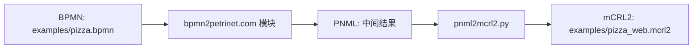

# 📚 转换流程说明（BPMN → PNML → mCRL2）

日期：2026-05-08

本文件用于说明从 BPMN 到 mCRL2 的完整转换流程，包含原理、步骤与代码位置，便于汇报与复现。

---

## 1) 端到端流程概览



可视化资源：

- Petri Net：`docs/visuals/pizza_petri.svg`（DOT 源：`docs/visuals/pizza_petri.dot`）
- mCRL2 结构示意：`docs/visuals/pizza_mcrl2_structure.svg`
- LTS 状态图：`docs/visuals/pizza_lts.svg`（DOT 源：`docs/visuals/pizza_lts.dot`）

---

## 2) BPMN → PNML（Web 模块）

### 原理

- 在浏览器上下文中直接调用 bpmn2petrinet.com 的 JS 模块：
  - `Importer`：解析 BPMN XML
  - `Parser`：生成 BPMN 语义模型
  - `Converter`：生成 Petri Net
  - `Exporter`：导出 PNML 字符串

### 对应代码

- `bpmn2mcrl2_web.py` → `bpmn_to_pnml_via_web()`

核心逻辑：

- 通过 `import('/src/bpmn2petri/index.js')` 加载模块
- 在浏览器端完成 PNML 生成
- 将 PNML 写入临时文件，再交给下一步处理

---

## 3) PNML → mCRL2（本地转换）

### 原理

- 从 PNML 中解析 `place / transition / arc`
- 构造 `Marking = Place -> Int`
- 对每个 transition：
  - 守卫条件：所有输入 place 的 token > 0
  - 更新函数：输入 place -1，输出 place +1
- 输出 mCRL2 进程：`P(m)`

### 对应代码

- `pnml2mcrl2.py`
  - `parse_pnml()`：解析 PNML
  - `_collect_pre_post()`：计算 pre/post 集
  - `_guard_expression()`：守卫条件生成
  - `_update_expression()`：更新函数生成
  - `generate_mcrl2()`：输出最终 mCRL2

---

## 3.1) PNML → mCRL2 对照表

| PNML 元素/概念 | 含义 | mCRL2 映射 | 说明 |
| --- | --- | --- | --- |
| `<place id="p">` | 库所（状态容器） | `Place` 枚举值（如 `p_0`） | place 会被排序并重命名为 `p_i` |
| `<transition id="t">` | 变迁（动作） | 动作 `fire_t_k` | 每个 transition 生成一个动作 |
| `<arc source="p" target="t">` | 输入弧（pre） | 守卫条件 `m(p_i) > 0` | 需要足够 token 才能触发 |
| `<arc source="t" target="p">` | 输出弧（post） | 更新函数 `m(p_i)+1` | 触发后向输出 place 加 token |
| `<initialMarking>` | 初始 token | `init(p_i) = n` | 作为初始状态定义 |
| Token 数量 | place 上的标记 | `Marking = Place -> Int` | 用函数表示所有 token |
| 变迁可发生 | 条件满足 | `(guard) -> fire_t_k . P(update_t_k(m))` | 守卫与更新形成一步动作 |

---

## 3.2) Pizza 示例具体映射实例 🍕

以 `examples/pizza.pnml` 为例，结构为：

- Places：`p_order`, `p_prepare`, `p_deliver`
- Transitions：`t_make`, `t_ship`
- Arcs：
  - `p_order -> t_make`
  - `t_make -> p_prepare`
  - `p_prepare -> t_ship`
  - `t_ship -> p_deliver`

在 mCRL2 中的具体映射（简化展示）：

| PNML | mCRL2 | 说明 |
| --- | --- | --- |
| `p_order` | `p_0` | 初始 token = 1 |
| `p_prepare` | `p_1` | 初始 token = 0 |
| `p_deliver` | `p_2` | 初始 token = 0 |
| `t_make` | `fire_t_0` | 触发后 `p_0-1`, `p_1+1` |
| `t_ship` | `fire_t_1` | 触发后 `p_1-1`, `p_2+1` |

对应的 mCRL2 片段（节选）：

- 初始标记：`init(p_0)=1, init(p_1)=0, init(p_2)=0`
- 动作定义：`fire_t_0, fire_t_1`
- 守卫与更新：
  - `m(p_0) > 0 -> fire_t_0 . P(update_t_0(m))`
  - `m(p_1) > 0 -> fire_t_1 . P(update_t_1(m))`

---

## 4) Pizza 示例运行步骤

```bash
python bpmn2mcrl2_web.py examples/pizza.bpmn -o examples/pizza_web.mcrl2
```

输出：`examples/pizza_web.mcrl2`

---

## 5) mCRL2 输出结构说明

- **Place 枚举**：`p_0, p_1, p_2`
- **初始标记**：`init(p_0)=1, init(p_1)=0, init(p_2)=0`
- **动作**：`fire_t_0`、`fire_t_1`
- **状态演化**：
  - `fire_t_0`：Order → Prepare
  - `fire_t_1`：Prepare → Deliver

---

## 6) 依赖与运行要求

- Python 3.9+
- Playwright（用于 Web 转换模块）

安装：

```bash
python -m pip install -r requirements.txt
python -m playwright install
```
