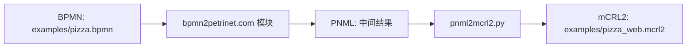
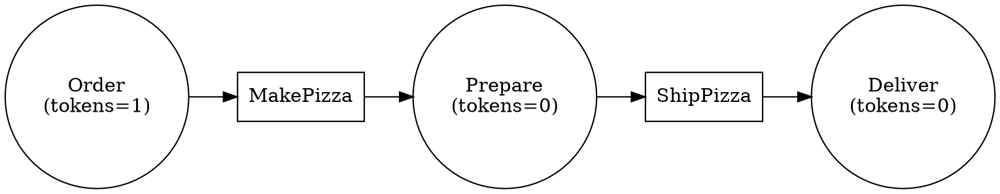

# 🧩 PNML to mCRL2 Converter

将 Petri Net 的 PNML 文件转换为 mCRL2 进程模型，并支持通过 bpmn2petrinet.com 完成 BPMN → PNML → mCRL2 的端到端转换。

## 📥 输入输出约定

- 输入：`.pnml` 文件（来自 BPMN → Petri Net 转换）
- 输出：`.mcrl2` 文件

## 🚀 快速开始

### 1) 运行转换（PNML → mCRL2）

```bash
python pnml2mcrl2.py examples/pizza.pnml -o examples/pizza.mcrl2
```

### 1b) BPMN → mCRL2（通过 bpmn2petrinet.com）

> 需要 Playwright 用于自动化网页转换

```bash
python -m pip install -r requirements.txt
python -m playwright install
python bpmn2mcrl2_web.py path/to/pizza.bpmn -o path/to/pizza.mcrl2
```

### 1c) Pizza 示例完整流程（BPMN → PNML → mCRL2） 🍕

该仓库已内置一个简单的 Pizza 流程示例，方便验证端到端转换：

1. **准备 BPMN 示例**：`examples/pizza.bpmn`
2. **调用网站模块生成 PNML（自动化）**：脚本会在浏览器上下文调用 bpmn2petrinet.com 的转换逻辑
3. **本地生成 mCRL2**：`pnml2mcrl2.py` 将 PNML 转换为 mCRL2

运行命令：

```bash
python bpmn2mcrl2_web.py examples/pizza.bpmn -o examples/pizza_web.mcrl2
```

输出说明：

- `examples/pizza_web.mcrl2`：端到端转换结果
- 该结果包含 `Place` 枚举、`Marking` 初始状态、`fire_*` 动作与更新函数

## 🖼️ 可视化每一步（适合 GitHub 展示）

### 1) 转换流程总览（Mermaid）



### 2) Pizza Petri Net 结构（Graphviz DOT）

> 对应 `examples/pizza.pnml` 的逻辑结构，可用 Graphviz 渲染



### 3) mCRL2 结构示意（动作与状态）

- **Place 枚举**：`p_0, p_1, p_2`
- **初始标记**：`init(p_0)=1, init(p_1)=0, init(p_2)=0`
- **动作**：`fire_t_0`（MakePizza），`fire_t_1`（ShipPizza）
- **状态演化**：
  - `fire_t_0`：`Order -> Prepare`
  - `fire_t_1`：`Prepare -> Deliver`

### 2) 运行测试

```bash
python -m unittest
```

## 🧠 转换原理（详细）

### 1) PNML 解析为 Petri Net 结构

脚本会解析 PNML 中的三类核心元素，并构建内部模型：

- **Place**：节点、名称、初始标记（token 数量）
- **Transition**：转换节点、名称
- **Arc**：有向边（place → transition 或 transition → place）

对应的数据结构在 `pnml2mcrl2.py` 中构建为：

- `places: Dict[place_id, Place]`
- `transitions: Dict[transition_id, Transition]`
- `arcs: List[Arc]`

### 2) 生成 Marking（状态）

在 mCRL2 中用函数 `Marking = Place -> Nat` 表示标记向量：

- 每个 place 映射为一个枚举值 `p_0, p_1, ...`
- 初始标记生成 `init(p_i) = n`

### 3) 计算每个 Transition 的前/后置集

对每个 transition $t$：

- **前置集 pre(t)**：所有输入 arc 的 source place
- **后置集 post(t)**：所有输出 arc 的 target place

### 4) 转换为 mCRL2 进程

每个 transition 生成一个动作：

- 动作名：`fire_t_k`
- 守卫条件：所有输入 place 的 token 数量 $> 0$

对应 mCRL2 中的片段形式：

$$
P(m) = (m(p_a) > 0 \wedge m(p_b) > 0) \to fire_t_k . P(update_{t_k}(m)) + \ldots
$$

### 5) 生成更新函数（token 流动）

每个 transition 对应一个更新函数 `update_t_k`：

- 输入 place 的 token -1
- 输出 place 的 token +1

使用 mCRL2 的 `lambda` 构造：

$$
update_{t_k}(m) = \lambda p:Place . \text{if}(p==p_i, m(p_i)-1, \ldots)
$$

### 6) 初始化

最终初始化为：

$$
init\;P(init)
$$

## 🌐 Web 转换说明（BPMN → PNML）

`bpmn2mcrl2_web.py` 通过 **Playwright** 打开 bpmn2petrinet.com，但并不依赖界面操作，而是在浏览器上下文中直接调用该站点的转换模块：

- `Importer` → 解析 BPMN XML
- `Parser` → 生成 BPMN 语义结构
- `Converter` → 转成 Petri Net
- `Exporter` → 输出 PNML 字符串

可通过参数控制网页配置：

- `--decorators yes|no`
- `--collapse-xor yes|no`
- `--timed-tasks yes|no`
- `--node-size` / `--flow-scaling` / `--graphviz-text`

## ✅ 适配说明

- 兼容 bpmn2petrinet.com 导出的 PNML
- Pizza 示例已验证可转换（见 `examples/pizza.bpmn` 和 `examples/pizza.pnml`）

- 该脚本基于 PNML 的 `place / transition / arc` 结构进行解析
- 转换规则：
  - 每个 transition 生成一个 `fire_*` 动作
  - 标记向量 `Marking` 作为状态
  - 守卫条件为输入 place 的 token ≥ 1
  - 更新函数用 mCRL2 的 `lambda` 构造

## 🗂 文件结构

- `pnml2mcrl2.py`：主转换脚本
- `bpmn2mcrl2_web.py`：BPMN → PNML → mCRL2（网页自动化）
- `examples/pizza.bpmn`：可用于网页转换的 Pizza BPMN 示例
- `examples/pizza.pnml`：BPMN Pizza 示例的 PNML
- `tests/test_converter.py`：最小验证测试
