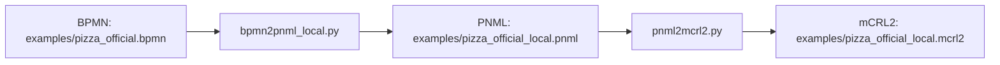
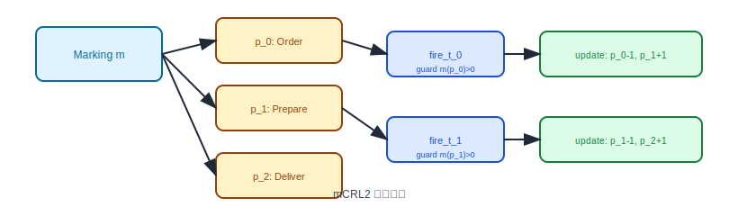

# 🧩 PNML to mCRL2 Converter

将 BPMN 转换为 Petri net PNML，再将 PNML 转换为 mCRL2 进程模型。仓库保留 bpmn2petrinet.com 的网页转换入口，同时提供一个面向官方 Pizza 协作流程的本地 BPMN-aware PNML 转换器，用于更准确处理 message flow、timer 和 event-based gateway。

## 📥 输入输出约定

- 输入：`.pnml` 文件（来自 BPMN → Petri Net 转换）
- 输出：`.mcrl2` 文件

## 🚀 快速开始

### 1) 运行转换（PNML → mCRL2）

```bash
python pnml2mcrl2.py examples/pizza_official_local.pnml -o examples/pizza_official_local.mcrl2
```

### 1b) BPMN → PNML（本地转换器）

```bash
python bpmn2pnml_local.py examples/pizza_official.bpmn -o examples/pizza_official_local.pnml
python pnml2mcrl2.py examples/pizza_official_local.pnml -o examples/pizza_official_local.mcrl2
```

### 1c) BPMN → mCRL2（通过 bpmn2petrinet.com）

> 需要 Playwright 用于自动化网页转换

```bash
python -m pip install -r requirements.txt
python -m playwright install
python bpmn2mcrl2_web.py path/to/pizza.bpmn -o path/to/pizza.mcrl2 --pnml-output path/to/pizza.pnml
```

默认输出会使用语义化 action 名称，例如 `order_a_pizza`、`bake_the_pizza`、`receive_payment`。如果需要旧版 `fire_t_i` 命名，可加 `--generic-actions`。

### 1d) 官方完整版 Pizza 示例（BPMN → PNML → mCRL2）

该仓库的主示例是 BPMN 官方完整版 Pizza 例子，不是只包含两个 task 的简化顺序流程。它覆盖了两个参与者、两个流程、消息流、事件网关、并行网关、等待/询问循环等结构。

1. **准备 BPMN 官方示例**：`examples/pizza_official.bpmn`
2. **本地生成 PNML**：`bpmn2pnml_local.py` 将 BPMN collaboration 转为 Petri net
3. **本地生成 mCRL2**：`pnml2mcrl2.py` 将 PNML 转换为 mCRL2

官方来源：

- [`BPMN Specification and Verification: The Pizza Example`](https://maude.lcc.uma.es/BPMN-R/pizza/)
- 该页面给出了原始 BPMN 文件和示意图，仓库中的 `examples/pizza_official.bpmn` 基于该公开例子整理

运行命令：

```bash
python bpmn2pnml_local.py examples/pizza_official.bpmn -o examples/pizza_official_local.pnml
python pnml2mcrl2.py examples/pizza_official_local.pnml -o examples/pizza_official_local.mcrl2
```

输出说明：

- `examples/pizza_official_local.pnml`：本地 BPMN-aware 转换器生成的 Petri net
- `examples/pizza_official_local.mcrl2`：本地 `PNML -> mCRL2` 结果
- 当前官方样例规模：BPMN 中 2 个 process、2 个 participant、9 个 task、6 条 message flow；本地 PNML 中 27 个 place、23 个 transition、56 条 arc
- `examples/pizza_official.pnml` 保留为 bpmn2petrinet.com 导出的对照版本
- `examples/pizza.bpmn` / `examples/pizza.pnml` 只是最小 smoke test，用来快速测试语法和工具链

## 🖼️ 可视化每一步（适合 GitHub 展示）

### 1) 转换流程总览（Mermaid）



### 2) 官方 Pizza Petri Net 规模

官方完整版经本地转换器生成的 PNML 不是 3 个 place / 2 个 transition 的线性网，而是：

- 27 个 place：包含 sequence flow、gating message flow、start/end 标记
- 23 个 transition：包含任务、事件、网关分支和终止同步
- 56 条 arc：表示 token 在控制流与消息流之间的移动

### 3) mCRL2 结构示意（动作与状态）

- **Place 枚举**：`p_0 ... p_26`
- **初始标记**：客户流程 start place 初始为 1，其余 place 初始为 0
- **动作**：默认使用语义化 action，如 `order_a_pizza`、`a_60_minutes`、`deliver_the_pizza`、`receive_payment`
- **可追溯映射**：生成的 mCRL2 文件头部包含 `Place mapping` 和 `Transition mapping`
- **示例 transition**：`order_a_pizza`、`bake_the_pizza`、`deliver_the_pizza`、`receive_payment`、`a_end_2`

结构示意图（SVG）：



### 2) 运行测试

```bash
python -m unittest
```

### 3) 运行 modal formula / LTS 检查

```bash
python scripts/check_pizza_official.py
```

该脚本会生成：

- `docs/verification/pizza_official/pizza_official_bounded.mcrl2`：用于穷尽 LTS 的 bounded 模型
- `docs/verification/pizza_official/pizza_official_bounded_lts.svg`：bounded LTS 可视化
- `docs/verification/pizza_official/pizza_official_verification_summary.svg`：公式检查结果摘要
- `docs/verification/pizza_official/results.json`：机器可读检查结果

检查脚本默认先用 `bpmn2pnml_local.py` 生成 `examples/pizza_official_local.pnml`，再用 `--max-place-tokens 1` 生成 bounded mCRL2，并用 `--max-lts-states 200` 生成可视化用的 partial LTS。原始 `examples/pizza_official_local.mcrl2` 不受影响。

当前检查结论：

- `order_a_pizza -> order_received` 可达
- `deliver_the_pizza` 可达
- `receive_payment` 可达
- `a_60_minutes -> ask_for_the_pizza -> calm_customer` 可达
- joined end `a_end_2` 可达
- bounded 模型存在 deadlock，这是两个 participant 都结束后的预期终止状态

和 bpmn2petrinet.com 的对照 PNML 相比，本地转换器修正了 message-flow 互等依赖：`Pay the pizza` 不再等待 `receipt` 才能发送 `money`，`Receive payment` 可以消费 `money` 并推进到结束。

## 🧠 转换原理（详细）

### 1) PNML 解析为 Petri Net 结构

脚本会解析 PNML 中的三类核心元素，并构建内部模型：

- **Place**：节点、名称、初始标记（token 数量）
- **Transition**：转换节点、名称
- **Arc**：有向边（place → transition 或 transition → place）

对应的数据结构在 `pnml2mcrl2.py` 中构建为：

- `places: Dict[place_id, Place]`
- `transitions: Dict[transition_id, Transition]`
- `arcs: List[Arc]`

### 2) 生成 Marking（状态）

在 mCRL2 中用函数 `Marking = Place -> Int` 表示标记向量：

- 每个 place 映射为一个枚举值 `p_0, p_1, ...`
- 初始标记生成 `init(p_i) = n`

### 3) 计算每个 Transition 的前/后置集

对每个 transition $t$：

- **前置集 pre(t)**：所有输入 arc 的 source place
- **后置集 post(t)**：所有输出 arc 的 target place

### 4) 转换为 mCRL2 进程

每个 transition 生成一个动作：

- 动作名：`fire_t_k`
- 守卫条件：所有输入 place 的 token 数量 $> 0$

对应 mCRL2 中的片段形式：

$$
P(m) = (m(p_a) > 0 \wedge m(p_b) > 0) \to fire_t_k . P(update_{t_k}(m)) + \ldots
$$

### 5) 生成更新函数（token 流动）

每个 transition 对应一个更新函数 `update_t_k`：

- 输入 place 的 token -1
- 输出 place 的 token +1

使用 mCRL2 的 `lambda` 构造：

$$
update_{t_k}(m) = \lambda p:Place . \text{if}(p==p_i, m(p_i)-1, \ldots)
$$

### 6) 初始化

最终初始化为：

$$
init\;P(m\_init)
$$

## 🌐 Web 转换说明（BPMN → PNML）

`bpmn2mcrl2_web.py` 通过 **Playwright** 打开 bpmn2petrinet.com，但并不依赖界面操作，而是在浏览器上下文中直接调用该站点的转换模块：

- `Importer` → 解析 BPMN XML
- `Parser` → 生成 BPMN 语义结构
- `Converter` → 转成 Petri Net
- `Exporter` → 输出 PNML 字符串

可通过参数控制网页配置：

- `--decorators yes|no`
- `--collapse-xor yes|no`
- `--timed-tasks yes|no`
- `--node-size` / `--flow-scaling` / `--graphviz-text`

## ✅ 适配说明

- 兼容 bpmn2petrinet.com 导出的 PNML，也提供本地 BPMN-aware PNML 生成器
- 官方完整版 Pizza 示例已贯通整个流程（见 `examples/pizza_official.bpmn`、`examples/pizza_official_local.pnml`、`examples/pizza_official_local.mcrl2`）
- 轻量示例只作为 smoke test 保留（见 `examples/pizza.bpmn` 和 `examples/pizza.pnml`）

- 该脚本基于 PNML 的 `place / transition / arc` 结构进行解析
- 转换规则：
- 每个 transition 生成一个 mCRL2 action
- 默认使用 transition 名称生成语义化 action；使用 `--generic-actions` 时生成 `fire_t_i`
- 标记向量 `Marking` 作为状态
- 守卫条件为输入 place 的 token >= 1
- 更新函数用 mCRL2 的 `lambda` 构造

## 🗂 文件结构

- `pnml2mcrl2.py`：主转换脚本
- `bpmn2pnml_local.py`：本地 BPMN → PNML 转换脚本
- `bpmn2mcrl2_web.py`：BPMN → PNML → mCRL2（网页自动化）
- `examples/pizza_official.bpmn`：官方 Pizza BPMN 示例
- `examples/pizza_official_local.pnml`：本地转换器导出的官方 Pizza PNML
- `examples/pizza_official_local.mcrl2`：官方 Pizza 示例的本地语义 mCRL2 输出
- `examples/pizza_official.pnml`：bpmn2petrinet.com 导出的对照 PNML
- `examples/pizza.bpmn` / `examples/pizza.pnml`：简化 smoke test
- `tests/test_converter.py`：最小验证测试
