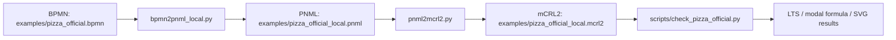

# BPMN -> Petri net -> mCRL2 工作说明

## 1. 工作目标

本项目的目标是建立一条可复现的自动化转换链路：

```text
BPMN -> Petri net(PNML) -> mCRL2
```

当前重点限定在这个主线内：先把 BPMN 转换为 Petri net，再将 Petri net 转换为 mCRL2。后续验证、LTS 可视化、modal formula 检查都围绕生成的 mCRL2 模型展开。

项目使用 BPMN 官方 Pizza 协作流程作为贯通实例。该实例不是简化的两任务顺序流程，而是包含两个 participant、两个 process、message flow、event-based gateway、parallel gateway、timer/等待询问循环的完整版流程。

## 2. 当前实现概览

当前仓库中已经形成三层能力：



主要脚本如下：

| 文件 | 作用 |
| --- | --- |
| `bpmn2pnml_local.py` | 本地 BPMN-aware 转 PNML，处理官方 Pizza 中的 message flow、timer 和 event-based gateway |
| `pnml2mcrl2.py` | 通用 PNML -> mCRL2 转换器 |
| `bpmn2mcrl2_web.py` | 保留的网页自动化入口，可调用 bpmn2petrinet.com 导出 PNML |
| `scripts/check_pizza_official.py` | 官方 Pizza 的验证脚本，生成 bounded mCRL2、partial LTS、SVG 和结果 JSON |
| `tests/test_converter.py` | 单元测试，覆盖 PNML 转换、本地 BPMN 转 PNML、bounded 模型等行为 |

## 3. 为什么新增本地 BPMN-aware PNML 转换器

最初链路依赖 `bpmn2petrinet.com` 生成 PNML。该方式可以自动得到 Petri net，但在官方 Pizza 例子中暴露出一个关键语义问题：message flow 被机械地建模成任务的前置条件，导致支付相关流程形成互等依赖。

网页 PNML 中的典型问题是：

```text
Pay the pizza 需要 receipt 才能发生
Receive payment 需要 money 才能发生
Pay the pizza 发生后才产生 money
Receive payment 发生后才产生 receipt
```

这样会导致 `receive_payment` 不可达，joined end 也不可达。这个结果说明网页导出的 PNML 可以作为对照，但不适合作为官方 Pizza 完整语义的唯一依据。

为保持项目主线不变，我们没有绕开 Petri net，而是实现了本地 BPMN-aware PNML 转换器：

```text
BPMN -> 本地语义更合理的 PNML -> mCRL2
```

本地转换器的核心策略是：

| BPMN 元素 | Petri net 映射 |
| --- | --- |
| sequence flow | place |
| flow node task/event/gateway | transition |
| start event | 消费对应 start place 或 message place |
| end event | 产生对应 process end place |
| parallel gateway | 消费一个输入并产生多个输出 |
| event-based gateway | 每个 incoming sequence flow 独立选择一个 outgoing branch |
| timer catch event | 普通 transition，消费 event-based gateway 选择出的 sequence place |
| gating message flow | message place，仅对 start/catch/receive 语义节点作为前置条件 |
| task-to-task 信息型 message flow | 不作为接收任务前置条件，避免人工互等依赖 |

## 4. 官方 Pizza 实例规模

官方 BPMN 文件：

```text
examples/pizza_official.bpmn
```

该 BPMN 中包含：

| 元素 | 数量 |
| --- | --- |
| process | 2 |
| participant | 2 |
| task | 9 |
| start event | 2 |
| end event | 2 |
| intermediate catch event | 3 |
| event-based gateway | 1 |
| parallel gateway | 1 |
| message flow | 6 |
| sequence flow | 18 |

两个 PNML 版本保留在仓库中：

| PNML 文件 | 来源 | place | transition | arc | 说明 |
| --- | --- | ---: | ---: | ---: | --- |
| `examples/pizza_official.pnml` | bpmn2petrinet.com | 24 | 18 | 46 | 对照版本，存在 message-flow 互等依赖 |
| `examples/pizza_official_local.pnml` | 本地转换器 | 27 | 23 | 56 | 当前主流程使用版本 |

当前主线输出：

```text
examples/pizza_official_local.mcrl2
```

## 5. PNML -> mCRL2 转换规则

`pnml2mcrl2.py` 会解析 PNML 中的 `place / transition / arc`，构造 mCRL2 模型。

核心映射如下：

| PNML 概念 | mCRL2 映射 |
| --- | --- |
| place | `Place` 枚举值，如 `p_0 ... p_26` |
| marking | `Marking = Place -> Int` |
| initialMarking | `m_init(p_i) = n` |
| transition | mCRL2 action |
| input arc | transition guard 中的 `m(p_i) > 0` |
| output arc | update 函数中的 token 加法 |
| firing | `guard -> action . P(update(m))` |

生成的 mCRL2 文件头部会保留映射注释，例如：

```text
% Transition mapping:
%   t_0/order_a_pizza = Order a pizza (_6-127), pre=[p_1], post=[p_2, p_14]
%   t_13/deliver_the_pizza = Deliver the pizza (_6-514), pre=[p_11], post=[p_12, p_15]
%   t_14/receive_payment = Receive payment (_6-565), pre=[p_12, p_17], post=[p_13]
%   t_22/a_end_2 = End (end_t), pre=[p_23, p_24], post=[p_22]
```

默认 action 使用语义化名称，例如：

```text
order_a_pizza
bake_the_pizza
deliver_the_pizza
receive_payment
where_is_my_pizza
calm_customer
a_end_2
```

如需旧式匿名 action，可使用：

```bash
python pnml2mcrl2.py examples/pizza_official_local.pnml -o out.mcrl2 --generic-actions
```

## 6. 验证与可视化

验证入口：

```bash
python scripts/check_pizza_official.py
```

该脚本会执行：

```text
PNML -> bounded mCRL2 -> LPS -> partial LTS -> SVG / JSON / Markdown
```

由于完整状态空间可能较大，脚本默认使用：

```text
--max-place-tokens 1
--max-lts-states 200
```

这两个限制只用于验证和可视化，不改变原始 `examples/pizza_official_local.mcrl2`。

输出文件：

| 文件 | 说明 |
| --- | --- |
| `docs/verification/pizza_official/pizza_official_bounded.mcrl2` | bounded 验证模型 |
| `docs/verification/pizza_official/pizza_official_bounded.lps` | mCRL2 LPS |
| `docs/verification/pizza_official/pizza_official_bounded.lts` | partial LTS |
| `docs/verification/pizza_official/pizza_official_bounded_lts.svg` | LTS 可视化 |
| `docs/verification/pizza_official/pizza_official_verification_summary.svg` | 检查结果摘要图 |
| `docs/verification/pizza_official/results.json` | 机器可读结果 |
| `docs/verification/pizza_official/README.md` | 人类可读验证报告 |

当前 LTS 摘要：

```text
Number of states: 200
Number of transitions: 199
Number of action labels: 18
LTS is deterministic: yes
```

当前 modal/action witness 检查结果：

| 性质 | 结果 | 说明 |
| --- | --- | --- |
| `order_a_pizza -> order_received` | true | 顾客下单后，商家可收到订单 |
| `deliver_the_pizza` reachable | true | 披萨可以被送达 |
| `receive_payment` reachable | true | 支付接收可以发生 |
| `a_60_minutes -> ask_for_the_pizza -> calm_customer` reachable | true | 等待询问与安抚循环可达 |
| joined end `a_end_2` reachable | true | 两个 participant 都可结束并 join |
| no deadlock | false | bounded 模型最终终止态是 deadlock，符合预期 |

可视化结果：

```text
docs/verification/pizza_official/pizza_official_verification_summary.svg
docs/verification/pizza_official/pizza_official_bounded_lts.svg
```

## 7. 运行命令汇总

安装依赖：

```bash
python -m pip install -r requirements.txt
python -m playwright install
```

主流程：

```bash
python bpmn2pnml_local.py examples/pizza_official.bpmn -o examples/pizza_official_local.pnml
python pnml2mcrl2.py examples/pizza_official_local.pnml -o examples/pizza_official_local.mcrl2
```

验证与可视化：

```bash
python scripts/check_pizza_official.py
```

网页对照流程：

```bash
python bpmn2mcrl2_web.py examples/pizza_official.bpmn -o examples/pizza_official.mcrl2 --pnml-output examples/pizza_official.pnml
```

测试：

```bash
python -m unittest discover -s tests -v
python -m py_compile bpmn2pnml_local.py pnml2mcrl2.py bpmn2mcrl2_web.py scripts/check_pizza_official.py tests/test_converter.py
mcrl22lps examples/pizza_official_local.mcrl2 /tmp/pizza_official_local_unbounded.lps
mcrl22lps docs/verification/pizza_official/pizza_official_bounded.mcrl2 /tmp/pizza_official_local_bounded.lps
```

## 8. 已验证状态

当前已通过：

```text
python -m unittest discover -s tests -v
5 tests passed
```

已通过 Python 编译检查：

```text
bpmn2pnml_local.py
pnml2mcrl2.py
bpmn2mcrl2_web.py
scripts/check_pizza_official.py
tests/test_converter.py
```

已通过 mCRL2 语法转换：

```text
examples/pizza_official_local.mcrl2 -> LPS
docs/verification/pizza_official/pizza_official_bounded.mcrl2 -> LPS
```

## 9. 当前边界与后续方向

当前本地 BPMN-aware PNML 转换器覆盖了官方 Pizza 所需的 BPMN 子集，主要包括：

```text
task
startEvent
endEvent
intermediateCatchEvent
parallelGateway
eventBasedGateway
sequenceFlow
messageFlow
```

当前尚未完整覆盖：

```text
exclusiveGateway / inclusiveGateway 的一般条件语义
subprocess
boundary event
compensation
data object / data association
多实例任务
真实时间语义
资源约束
复杂事件定义
```

建议下一步工作：

1. 将 `bpmn2pnml_local.py` 扩展为更通用的 BPMN 子集转换器。
2. 为 gateway、timer、message flow 增加更多官方 BPMN 示例测试。
3. 将 modal formula 检查从 action witness 扩展为更严格的 PBES 性质验证。
4. 增加 Petri net 可视化，展示 BPMN 节点到 PNML place/transition 的映射。
5. 把当前脚本整理成统一 CLI，例如 `python convert.py bpmn --verify --visualize`。

## 10. 阶段性结论

当前项目已经完成了官方 Pizza 示例的端到端贯通：

```text
官方 BPMN -> 本地 PNML -> mCRL2 -> bounded LTS -> 验证结果与 SVG 可视化
```

相比直接使用 bpmn2petrinet.com 的 PNML，本地 BPMN-aware PNML 转换器解决了官方 Pizza 中最关键的 message-flow 互等问题，使 `receive_payment`、询问/安抚循环和 joined end 都变为可达。

因此，目前工作已经从“能生成 mCRL2 文本”推进到“能用官方复杂 BPMN 示例生成可解释、可验证、可视化的 mCRL2 模型”。
