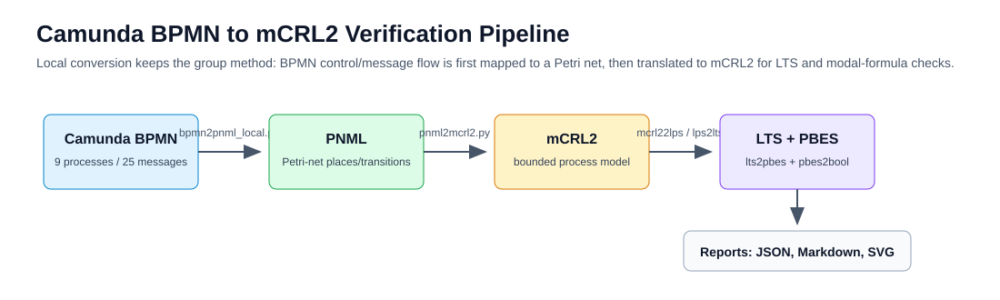
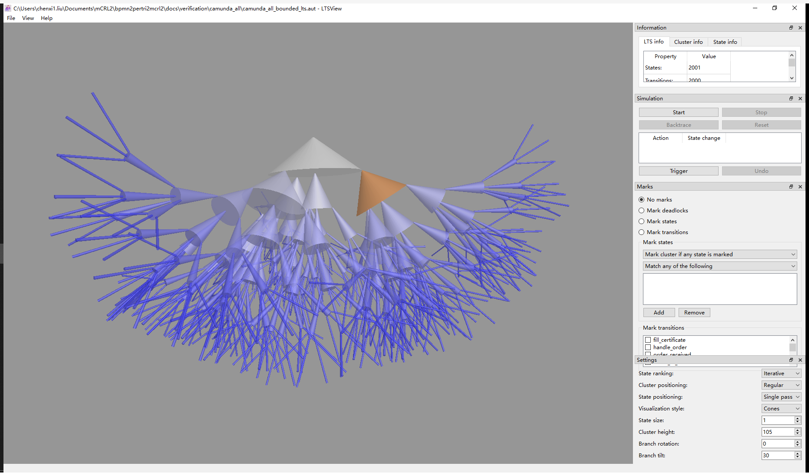
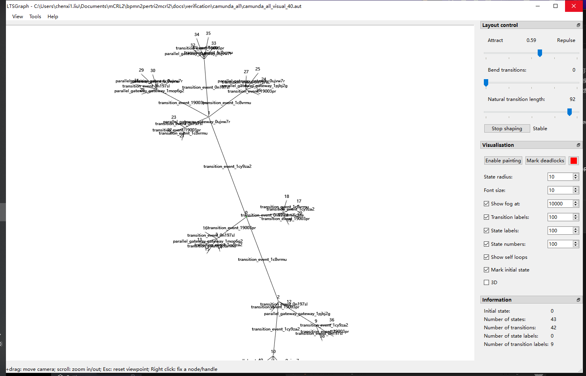
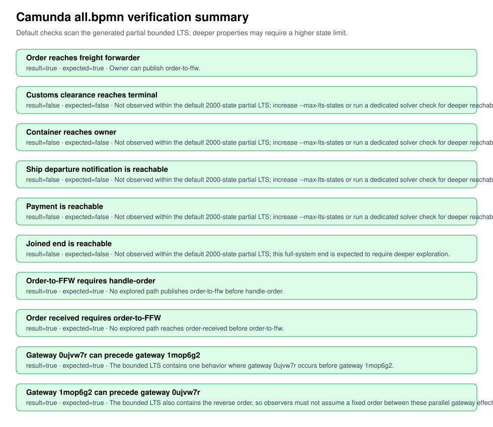

# Camunda 协作流程的 mCRL2 验证报告

## 1. 实验任务

本实验只覆盖 mCRL2 方向，目标是把整合版 Camunda 协作流程转换为可验证的进程模型，并重点检查海关协作场景。需要完成的任务如下：

| 编号 | 任务 | 完成情况 |
| --- | --- | --- |
| T1 | 将 `Camunda-all-main/merged_code/bpmn/all.bpmn` 转换为 PNML | 已完成 |
| T2 | 将 PNML 转换为 bounded mCRL2 模型 | 已完成 |
| T3 | 使用 mCRL2 工具生成 LPS、LTS、AUT、DOT 和可视化图片 | 已完成 |
| T4 | 在 mCRL2 图形界面中查看 LTS，并保留截图 | 已完成 |
| T5 | 验证关键消息动作和前段消息因果关系 | 已完成 |
| T6 | 重点验证海关场景：舱单、箱/船到达、报关单、CIQ、查验、放行到码头 | 已完成 |
| T7 | 输出可复现的 JSON、README、截图和实验报告 | 已完成 |

## 2. 实验对象

输入模型是整合后的 Camunda 8 BPMN：

```text
Camunda-all-main/merged_code/bpmn/all.bpmn
```

该模型包含 9 个 process、25 条 message flow、29 个 Zeebe task type 和 8 个 parallel gateway。验证时不展开 Camunda 运行时变量、RabbitMQ、REST/gRPC 或 `orderId` 的具体字符串值，而是把跨组织交互抽象为 Petri net 中的消息 token，再映射到 mCRL2 action。

## 3. 转换与验证链路

整体流水线如图 1 所示：



转换过程分为 5 步：

1. `bpmn2pnml_local.py` 解析 Camunda BPMN，并生成 PNML。
2. `pnml2mcrl2.py` 将 PNML 的 place、transition、arc 转换为 mCRL2 进程。
3. `mcrl22lps` 将 mCRL2 模型线性化为 LPS。
4. `lps2lts` 生成 bounded LTS，默认每个 place 最多 1 个 token，最多展开 2000 个状态。
5. `lts2pbes + pbes2bool` 和 `lps2lts --action` 用于性质验证和 targeted witness 搜索。

核心输出目录为：

```text
docs/verification/camunda_all/
```

## 4. Camunda 兼容性处理

为了让 Camunda 模型转换后仍然保留可读的业务动作名，转换器做了几项处理：

| BPMN/Camunda 信息 | 处理方式 |
| --- | --- |
| `zeebe:taskDefinition/@type` | 优先作为 transition label 和 mCRL2 action 名 |
| `<bpmn:message>` 的 `id -> name` | 当 message flow 本身无名时，用 message 名称作为消息 place label |
| plain start event | 转换为带初始 token 的流程入口 |
| message start event | 必须等待上游 message flow token 后才能启动 |
| `orderId` 等运行时变量 | 不建模具体值，只保留消息同步关系 |

这种抽象保留了本实验最关心的跨组织控制流和消息交互，同时避免状态空间被运行时数据值放大。

## 5. LTS 可视化结果

默认 bounded LTS 的规模如下：

| 指标 | 数值 |
| --- | --- |
| states | 2001 |
| transitions | 2000 |
| action labels | 12, including tau |
| state labels | 2001 |
| deterministic | yes |
| probabilistic states | no |

图 2 是在 mCRL2 `LTSView` 中打开全状态 bounded LTS 后截取的界面。右侧动作列表和下方状态图说明模型已经成功进入 mCRL2 的行为分析界面。



完整 LTS 的图形较密，因此另外生成了一个 40 状态展示版，并用 `LTSGraph` 调整布局，如图 3 所示。



## 6. 基础性质验证

第一组性质用于检查关键动作和前段消息因果关系。

| 性质 | 结果 | 说明 |
| --- | --- | --- |
| `order_to_ffw` 可达 | true | 货主可以向货代发送订单 |
| `handle_order -> order_to_ffw` | true | 未发现未处理订单就发送给货代的路径 |
| `order_to_ffw -> order_received` | true | 未发现货代先收到订单、货主后发送订单的路径 |
| `customs_clearance_to_terminal` 在默认 BFS LTS 中可达 | false | 默认前 2000 个 BFS 状态内未观察到 |
| `ctn_to_owner` 在默认 BFS LTS 中可达 | false | 默认前 2000 个 BFS 状态内未观察到 |
| `payment` 在默认 BFS LTS 中可达 | false | 默认前 2000 个 BFS 状态内未观察到 |
| joined end `a_end` 在默认 BFS LTS 中可达 | false | 全流程汇合结束需要更深展开 |

图 4 是公式验证摘要。



这里的 false 不是“业务上不可达”，而是“当前 BFS partial LTS 的前 2000 个状态内没有观察到”。该模型有 9 个参与方和多个并发入口，BFS 很容易先展开前段和并发分支，导致海关、码头、付款等深层动作被挤出默认状态预算。

## 7. 海关场景验证

海关场景是本实验的重点。整合版 BPMN 中，海关流程的关键结构如下：

1. 海关流程启动后进入并行等待区。
2. 海关需要收到三类输入：
   - `manifest_received`：舱单信息；
   - `ctn_and_ship_arrive`：箱/船到达信息；
   - `declaration_received`：报关单。
3. 海关向报关行反馈 `clearance_to_broker`。
4. 报关行提交 `inspection_appointment`。
5. 三类输入汇聚后，海关执行 `ciq` 和 `inspection`。
6. 最后海关向码头发送 `customs_clearance_to_terminal`。

由于默认 BFS LTS 没有在前 2000 个状态内覆盖到海关放行，本实验使用 targeted depth-first action 搜索检查这些动作是否存在。结果如下：

| 海关动作 | 结果 | 发现位置 | 含义 |
| --- | --- | ---: | --- |
| `manifest_received` | true | state 172 | 海关能收到舱单 |
| `ctn_and_ship_arrive` | true | state 202 | 海关能收到箱/船到达信息 |
| `declaration_received` | true | state 172 | 海关能收到报关单 |
| `clearance_to_broker` | true | state 177 | 海关能向报关行反馈处理结果 |
| `inspection_appointment` | true | state 181 | 报关行能提交查验预约 |
| `ciq` | true | state 204 | 海关能执行检验检疫 |
| `inspection` | true | state 205 | 海关能执行查验 |
| `customs_clearance_to_terminal` | true | state 206 | 海关能向码头发送放行消息 |

这些结果说明：海关链路在转换后的 mCRL2 模型中是可达的。默认表格中的 `customs_clearance_to_terminal=false` 只是 BFS partial LTS 的观察边界，不代表海关放行不可达。

## 8. 结果分析

从转换结果看，`all.bpmn` 可以进入完整的 mCRL2 工具链，并生成可被 mCRL2 GUI 打开的 LTS。这说明 BPMN 到 PNML、PNML 到 mCRL2、mCRL2 到 LTS 的链路是连通的。

从协作行为看，前段 Owner 到 Freight Forwarder 的订单发送和接收顺序得到保持。海关段的 targeted witness 进一步说明，监管汇聚场景中的关键输入和输出没有在转换中丢失：

| 协作阶段 | 验证结论 |
| --- | --- |
| 货主发起订单 | 可达 |
| 货主发送订单到货代 | 可达 |
| 货代收到订单 | 因果顺序正确 |
| 海关收到舱单 | 可达 |
| 海关收到箱/船到达信息 | 可达 |
| 海关收到报关单 | 可达 |
| 海关执行 CIQ 和查验 | 可达 |
| 海关放行到码头 | 可达 |

当前验证仍是 bounded 验证。它证明的是“在给定 token 边界和 targeted 搜索策略下存在相应行为”，不是完整无界证明。对于课程 mCRL2 协作部分，这个结果已经覆盖了转换链路、LTS 可视化、关键消息因果和海关核心协作场景。

## 9. 结论

本实验完成了 Camunda 整合版 BPMN 的 mCRL2 验证接入，并重点验证了海关场景。结论如下：

1. `all.bpmn` 可以成功转换为 PNML 和 bounded mCRL2。
2. 生成的 mCRL2 可以通过 `mcrl22lps`、`lps2lts` 生成 LPS 和 LTS。
3. LTS 已在 mCRL2 `LTSView` 和 `LTSGraph` 中打开并截图。
4. 前段订单消息的因果关系保持正确。
5. 海关场景中的舱单、箱/船到达、报关单、CIQ、查验、放行到码头均可达。
6. 默认 BFS partial LTS 的 false 结果应解释为状态预算内未观察到，而不是业务不可达。

## 10. 复现实验命令

在仓库根目录运行：

```powershell
.\scripts\check_camunda_all.ps1
```

或直接指定本地 Python：

```powershell
C:\Users\chenxi1.liu\Documents\mCRL2\.tools\python313\python.exe scripts\check_camunda_all.py
```

核心输出：

```text
docs/verification/camunda_all/results.json
docs/verification/camunda_all/README.md
docs/verification/camunda_all/camunda_all_bounded.mcrl2
docs/verification/camunda_all/camunda_all_bounded.lts
docs/verification/camunda_all/mcrl2_ltsview_full_lts_screenshot.png
```
