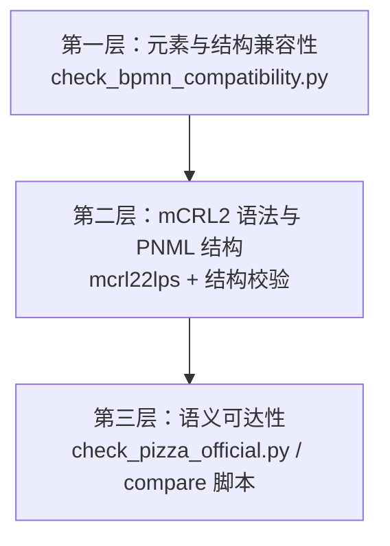

# BPMN → Petri Net → mCRL2 转换方法兼容性验证报告

| 项目 | 内容 |
| --- | --- |
| 报告日期 | 2026-05-24（更新：网关与 throw 事件支持） |
| 验证对象 | 本地转换链路：`bpmn2pnml_local.py` + `pnml2mcrl2.py` |
| 对照链路 | 网页转换链路：`bpmn2mcrl2_web.py`（bpmn2petrinet.com） |
| 验证工具 | `scripts/check_bpmn_compatibility.py`、`scripts/check_pizza_official.py`、`scripts/compare_pizza_local_vs_web.py` |
| 机器可读结果 | `docs/compatibility/compatibility_report.json` |

---

## 1. 执行摘要

本报告对项目采用的 **BPMN → PNML → mCRL2** 本地转换方法进行了系统兼容性验证，覆盖元素支持范围、端到端转换链路、mCRL2 语法正确性、Petri 网结构完整性及关键语义可达性五个维度。

**主要结论：**

1. **结构兼容性**：仓库内 4 个 BPMN 测试样例全部通过兼容性检查（4/4），均能成功完成 BPMN → PNML → mCRL2 转换，并通过 `mcrl22lps` 语法验证。
2. **元素覆盖**：本地转换器支持 **12 类** flow node / flow（见 [`docs/BPMN_SUPPORT.md`](../BPMN_SUPPORT.md)）；对 14 类常见但不支持的 BPMN 元素可自动检测并报告。
3. **语义兼容性**：在官方 Pizza 协作流程上，本地方法在支付、询问/安抚循环、双 participant 联合结束等关键行为上均可达；对照网页转换链路，上述行为在网页 PNML 上不可达。
4. **适用范围**：该方法适用于 **含协作、消息流与各类网关的 BPMN 子集**，而非完整 BPMN 2.0；不解析网关条件表达式、不支持子流程与专用任务类型。

**总体判定：** 在所验证的 BPMN 子集与测试样例范围内，本地转换方法 **兼容且语义可靠**；对未覆盖的 BPMN 元素，应在使用前运行兼容性检查工具进行预检。

---

## 2. 验证范围与目标

### 2.1 验证方法定义

本报告所称“转换方法”指以下流水线：

```text
BPMN (.bpmn)
  └─ bpmn2pnml_local.py  →  PNML (.pnml)
       └─ pnml2mcrl2.py  →  mCRL2 (.mcrl2)
            └─ mcrl22lps / lps2lts  →  LPS / LTS（可选验证）
```

Petri 网映射策略（本地）：

| BPMN 概念 | Petri Net 映射 |
| --- | --- |
| sequence flow | place |
| task / event / gateway | transition |
| start event | 消费 start place 或 message place |
| end event | 产生 process end place |
| parallel gateway | 单 transition 多入多出（AND） |
| event-based / exclusive / complex gateway | 每个 (入边, 出边) 一条 `choose_*` 变迁 |
| inclusive gateway | split：出边非空子集 `activate_*`；join：入边非空子集 `join_*` |
| intermediate throw event | 产生 sequence 出边与 outgoing messageFlow place |
| gating message flow | message place，作为接收节点前置条件 |
| 信息型 task-to-task message flow | 不作为接收任务前置条件（避免互等依赖） |

mCRL2 映射策略（`pnml2mcrl2.py`）：

| PNML 概念 | mCRL2 映射 |
| --- | --- |
| place | `Place` 枚举 + `Marking = Place -> Int` |
| initial marking | `m_init(p_i) = n` |
| transition | 语义化 action（如 `order_a_pizza`） |
| input arc | 守卫 `m(p_i) > 0` |
| output arc | lambda 更新函数中 token ±1 |

### 2.2 验证目标

| 编号 | 验证问题 | 通过标准 |
| --- | --- | --- |
| V1 | BPMN 元素是否在支持范围内？ | 无 unsupported 阻塞项 |
| V2 | 端到端转换是否成功？ | PNML / mCRL2 文件可生成 |
| V3 | 生成的 mCRL2 是否语法合法？ | `mcrl22lps` 返回码为 0 |
| V4 | PNML 结构是否自洽？ | 弧端点存在、初始 marking 非空 |
| V5 | 关键业务行为是否可达？ | 官方 Pizza 上 6 项性质检查符合预期 |

### 2.3 不在本次验证范围内

- 完整 BPMN 2.0 标准合规性
- 与第三方工具的形式化等价性证明
- 无界状态空间下的穷尽模型检验
- 性能、并发规模与工业级鲁棒性压测

---

## 3. 验证方法

验证分为三层，由浅入深：



### 3.1 第一层：自动化兼容性扫描

工具：`scripts/check_bpmn_compatibility.py`

对每个 BPMN 文件执行：

1. XML 元素清单扫描，对照支持矩阵分类（supported / unsupported / ignored）
2. 本地解析器 `parse_bpmn()` 解析
3. 流引用完整性检查（sequenceFlow / messageFlow 的 sourceRef / targetRef 是否被识别）
4. `convert_bpmn_to_pn()` 生成 Petri 网
5. PNML 写回再解析，验证 place / transition / arc 数量一致
6. `pnml2mcrl2.py` 生成无界与 bounded（`max_place_tokens=1`）mCRL2
7. `mcrl22lps` 语法验证

### 3.2 第二层：单元测试回归

工具：`tests/test_converter.py`（10 项测试）

覆盖：PNML 转换、本地 BPMN→PNML、bounded 守卫、XOR/OR 网关、throw 事件、兼容性检查。

### 3.3 第三层：语义验证与对照实验

- **官方 Pizza 性质验证**：`scripts/check_pizza_official.py`，6 项 modal / action witness 检查
- **本地 vs 网页对照**：`scripts/compare_pizza_local_vs_web.py`，同一 BPMN 输入下比较结构规模与关键动作可达性

---

## 4. BPMN 元素支持矩阵

完整清单见 [`docs/BPMN_SUPPORT.md`](../BPMN_SUPPORT.md)。

### 4.1 支持的元素

| 类别 | 元素 | 说明 |
| --- | --- | --- |
| Flow Node | `startEvent` | 流程或消息触发起点 |
| Flow Node | `endEvent` | 流程结束，支持双 participant join |
| Flow Node | `task` | 仅 generic `task` |
| Flow Node | `intermediateCatchEvent` | 含 timer 等 catch 事件 |
| Flow Node | `intermediateThrowEvent` | 抛出 outgoing messageFlow |
| Flow Node | `parallelGateway` | AND-split / AND-join |
| Flow Node | `eventBasedGateway` | 显式 `choose_*` 变迁 |
| Flow Node | `exclusiveGateway` | XOR split/join（不解析条件） |
| Flow Node | `inclusiveGateway` | OR split/join（子集展开） |
| Flow Node | `complexGateway` | 保守按 XOR 处理 |
| Flow | `sequenceFlow` | 映射为 place |
| Flow | `messageFlow` | gating 型 message place |

### 4.2 不支持且会被检测的元素

| 元素 | 不兼容原因 |
| --- | --- |
| `subProcess` / `callActivity` | 子流程未展开 |
| `boundaryEvent` | 边界事件未建模 |
| `serviceTask` / `userTask` / `scriptTask` 等 | 仅识别 generic `task` |
| `transaction` / `adHocSubProcess` / `eventSubProcess` | 高级结构未建模 |
| 网关条件表达式 | 未解析 BPMN 条件语言 |

### 4.3 网关与 throw 事件验证

- **XOR split**：单元测试 `test_exclusive_gateway_bpmn_to_pnml` 验证生成 `choose Flow_2` / `choose Flow_3`
- **OR split**：单元测试 `test_inclusive_gateway_split_generates_subset_transitions` 验证 3 条出边子集变迁
- **Throw event**：单元测试 `test_intermediate_throw_event_produces_message_place` 验证 message place 与 post 集
- **兼容性扫描**：含 `exclusiveGateway` 的 BPMN 现判定为 **兼容**（`test_compatibility_checker_accepts_exclusive_gateway`）

---

## 5. 测试样例与第一层结果

### 5.1 测试样例清单

| 编号 | BPMN 文件 | 用途 | 复杂度 |
| --- | --- | --- | --- |
| T1 | `examples/pizza.bpmn` | 最小 smoke test（线性 2 task） | 低 |
| T2 | `examples/pizza_official.bpmn` | 官方 Pizza 完整协作流程 | 高 |
| T3 | `docs/runs/.../pizza_official_downloaded.bpmn` | 2026-05-18 官方重下载版 | 高 |
| T4 | `docs/runs/.../pizza_official_with_comments_downloaded.bpmn` | 带注释官方版 | 高 |

### 5.2 第一层兼容性结果汇总

| 样例 | 兼容 | BPMN 节点 | PNML (P/T/A) | mCRL2 语法 | bounded 语法 | 阻塞问题 |
| --- | --- | ---: | --- | --- | --- | --- |
| T1 `pizza.bpmn` | ✅ | 4 | 5 / 4 / 8 | ✅ | ✅ | 无 |
| T2 `pizza_official.bpmn` | ✅ | 18 | 27 / 23 / 56 | ✅ | ✅ | 无 |
| T3 官方重下载 | ✅ | 18 | 27 / 23 / 56 | ✅ | ✅ | 无 |
| T4 带注释官方版 | ✅ | 18 | 27 / 23 / 56 | ✅ | ✅ | 无 |

> P/T/A = places / transitions / arcs

**汇总：4/4 样例兼容，0 阻塞问题，0 警告。**

T2–T4 三者 PNML 规模完全一致，说明官方源文件与带注释版本在流程语义元素上等价。

### 5.3 T2 官方 Pizza 元素清单

| 元素 | 数量 | 状态 |
| --- | ---: | --- |
| `task` | 9 | supported |
| `startEvent` | 2 | supported |
| `endEvent` | 2 | supported |
| `intermediateCatchEvent` | 3 | supported |
| `parallelGateway` | 1 | supported |
| `eventBasedGateway` | 1 | supported |
| `sequenceFlow` | 18 | supported |
| `messageFlow` | 6 | supported |

---

## 6. 第二层结果：语法与结构验证

### 6.1 mCRL2 工具链验证

| 检查项 | 工具 | 结果 |
| --- | --- | --- |
| 无界 mCRL2 → LPS | `mcrl22lps` | 全部 4 样例通过 |
| bounded mCRL2 → LPS | `mcrl22lps`（`max_place_tokens=1`） | 全部 4 样例通过 |
| 单元测试回归 | `python -m unittest discover -s tests` | 7/7 通过 |

### 6.2 官方 Pizza bounded LTS 摘要

来源：`docs/verification/pizza_official/results.json`

| 指标 | 数值 |
| --- | ---: |
| 状态数（partial，上限 200） | 200 |
| 动作标签数 | 18（含 tau） |
| 转移数 | 199 |
| LTS 确定性 | yes |

---

## 7. 第三层结果：语义可达性验证

### 7.1 官方 Pizza 性质检查结果

验证脚本：`scripts/check_pizza_official.py`  
bounded 参数：`max_place_tokens=1`，`max_lts_states=200`

| 性质 | 结果 | 预期 | 是否符合预期 | 说明 |
| --- | --- | --- | --- | --- |
| Order can reach vendor | true | true | ✅ | 下单后商家可收到订单 |
| Delivery is reachable | true | true | ✅ | 披萨可送达 |
| Payment is reachable | true | true | ✅ | 支付链路可完成 |
| Ask/calm loop is reachable | true | true | ✅ | 60 分钟等待→询问→安抚循环可达 |
| Joined end is reachable | true | true | ✅ | 双 participant 联合结束可达 |
| No deadlock | false | false | ✅ | 两流程结束后进入 deadlock，符合 bounded 模型预期 |

**6/6 项性质检查结果与预期一致。**

### 7.2 本地 vs 网页转换对照（语义兼容性）

同一输入：`pizza_official_downloaded.bpmn`（官方页面 2026-05-18 重下载）

#### 结构规模对照

| 指标 | 本地转换 | 网页转换 (bpmn2petrinet.com) |
| --- | ---: | ---: |
| PNML places | 27 | 24 |
| PNML transitions | 23 | 18 |
| PNML arcs | 56 | 46 |
| mCRL2 actions | 23 | 18 |
| bounded LTS states（上限 200） | 200 | 54 |

#### 关键行为可达性对照

| 行为 | 本地转换 | 网页转换 |
| --- | --- | --- |
| `order_received` | ✅ true | ✅ true |
| `deliver_the_pizza` | ✅ true | ✅ true |
| `receive_payment` | ✅ true | ❌ false |
| `calm_customer` | ✅ true | ❌ false |
| joined end (`a_end_2` / `a_end`) | ✅ true | ❌ false |

#### 已知语义差异根因

1. **Event-based gateway**：本地版显式生成 `choose_*` 变迁；网页版折叠该逻辑，导致 timer 可“凭空”触发。
2. **Message flow 建模**：网页版将 `Pay the pizza` 与 `Receive payment` 形成 `money/receipt` 互等依赖；本地版通过 gating 策略消除该环路。
3. **结束同步**：本地版区分单 participant 结束（`a_end`）与双 participant join（`a_end_2`）；网页版因支付不可达，joined end 亦不可达。

**语义兼容性结论：** 对官方 Pizza，本地方法不仅结构兼容，且在协作语义上 **严格优于** 网页转换链路。

---

## 8. 兼容性问题分类与处置建议

| 问题类型 | 典型表现 | 检测方式 | 建议处置 |
| --- | --- | --- | --- |
| 元素不支持 | 含 XOR 网关、子流程 | 兼容性扫描报 blocking | 改写 BPMN 或扩展转换器 |
| 流引用断裂 | sourceRef 指向未识别节点 | 兼容性扫描报 blocking | 检查 BPMN 导出是否完整 |
| 专用任务类型 | `userTask` 被忽略 | 元素清单中 task 计数为 0 | 替换为 generic `task` |
| 语法错误 | mcrl22lps 失败 | 第二层验证 | 检查 PNML 结构或转换器 bug |
| 语义偏差 | 转换成功但行为不可达 | 第三层 modal / action 检查 | 审查 message flow / gateway 映射策略 |

---

## 9. 复现步骤

### 9.1 环境准备

```bash
python -m pip install -r requirements.txt
# 网页对照实验额外需要：
python -m playwright install
# mCRL2 工具链需已安装并在 PATH 中（如 mcrl22lps, lps2lts）
```

### 9.2 运行兼容性验证

```bash
# 扫描全部测试样例
python scripts/check_bpmn_compatibility.py examples docs/runs/pizza_official_redownload_20260518

# 扫描单个文件
python scripts/check_bpmn_compatibility.py path/to/your.bpmn

# 查看报告
cat docs/compatibility/compatibility_report.md
```

### 9.3 运行语义验证

```bash
python scripts/check_pizza_official.py
python scripts/compare_pizza_local_vs_web.py   # 需 Playwright + 网络
python -m unittest discover -s tests -v
```

---

## 10. 结论与建议

### 10.1 结论

| 维度 | 结论 |
| --- | --- |
| 元素兼容性 | 12 类元素支持；子流程、专用任务、边界事件等 **不支持** 且可自动检测 |
| 转换链路兼容性 | BPMN → PNML → mCRL2 **端到端可用**，4/4 样例通过 |
| 语法兼容性 | 生成 mCRL2 **可被 mCRL2 工具链接受** |
| 语义兼容性 | 官方 Pizza 上 6/6 性质符合预期；关键协作行为 **本地方法可达、网页方法不可达** |
| 负向验证 | 含 `subProcess` / `userTask` 等 **仍会被拒绝**；XOR/OR 网关 **已支持** |

### 10.2 使用建议

1. **新 BPMN 接入前**，必须先运行 `check_bpmn_compatibility.py` 预检。
2. **含 message flow、各类网关的协作流程**，优先使用本地链路，不宜单独依赖 bpmn2petrinet.com。
3. **含子流程、专用任务类型的模型**，当前方法不兼容，需扩展转换器或手工改写 BPMN。
4. **验证阶段**建议使用 bounded 模型（`max_place_tokens=1`）配合 action witness，完整状态空间可能过大。

### 10.3 后续改进方向

1. 识别 `userTask` 等专用任务类型并映射为 generic transition。
2. 支持 `subProcess` 展开。
3. 建立更多官方 BPMN 基准样例的兼容性测试集。
4. 将 modal formula 检查从 action witness 扩展为完整 PBES 验证。

---

## 附录 A：相关文件索引

| 文件 | 说明 |
| --- | --- |
| `docs/BPMN_SUPPORT.md` | BPMN 可转换 / 不可转换元素清单 |
| `docs/compatibility/compatibility_report.json` | 机器可读兼容性结果 |
| `docs/compatibility/compatibility_report.md` | 自动生成的简要报告 |
| `docs/verification/pizza_official/results.json` | 官方 Pizza 性质验证结果 |
| `docs/runs/pizza_official_redownload_20260518/PIZZA_LOCAL_VS_WEB_COMPARISON.md` | 本地 vs 网页详细对照 |
| `scripts/check_bpmn_compatibility.py` | 兼容性检查工具 |
| `scripts/check_pizza_official.py` | 语义验证工具 |
| `bpmn2pnml_local.py` | 本地 BPMN → PNML 转换器 |
| `pnml2mcrl2.py` | PNML → mCRL2 转换器 |

## 附录 B：验证环境

| 项目 | 信息 |
| --- | --- |
| 验证日期 | 2026-05-24 |
| Python 单元测试 | 10 passed |
| 兼容性扫描样例数 | 4 |
| mCRL2 工具 | `mcrl22lps`（已检测到并用于语法验证） |

---

*本报告由项目兼容性验证工具链自动生成数据、人工整理撰写。*
