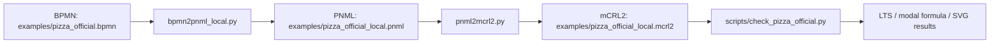

# 项目说明报告：BPMN -> PNML -> mCRL2 转换链路

日期：2026-05-19

## 1. 报告目的

本报告用于说明当前仓库的核心工作内容、实现方式、验证结果和使用方法。项目主线是将 BPMN 协作流程转换为 Petri net（PNML），再进一步转换为 mCRL2，并通过 LTS 与 modal formula 对模型语义进行验证。

本仓库的重点案例是官方 Pizza 协作流程。它不是一个简单的顺序工作流，而是包含两个 participant、消息流、事件网关、并行网关、定时等待和询问循环的完整 BPMN 协作例子，因此非常适合作为语义验证样本。

## 2. 项目目标

项目目标可以概括为三点：

1. 建立一条可复现的转换链路：`BPMN -> PNML -> mCRL2`
2. 保留 BPMN 协作流程中的关键语义，尤其是 message flow、timer 和 event-based gateway
3. 对转换结果进行形式化验证，确认重要行为在 mCRL2 模型中可达

## 3. 总体流程

当前仓库中形成了三层能力：



### 3.1 主要脚本

| 文件 | 作用 |
| --- | --- |
| `bpmn2pnml_local.py` | 本地 BPMN-aware 转 PNML，重点处理官方 Pizza 的 message flow、timer 和 event-based gateway |
| `pnml2mcrl2.py` | 通用 PNML -> mCRL2 转换器 |
| `bpmn2mcrl2_web.py` | 保留的网页自动化入口，可通过 bpmn2petrinet.com 导出 PNML |
| `scripts/check_pizza_official.py` | 官方 Pizza 的验证脚本，生成 bounded mCRL2、partial LTS、SVG 和结果 JSON |
| `tests/test_converter.py` | 单元测试，覆盖 PNML 转换、本地 BPMN 转 PNML、bounded 模型等行为 |

## 4. 官方 Pizza 样例

官方 BPMN 文件位于：

`examples/pizza_official.bpmn`

该样例的来源是官方 Pizza 页面：

- 页面：`https://maude.lcc.uma.es/BPMN-R/pizza/`
- 原始 BPMN：`https://maude.lcc.uma.es/BPMN-R/pizza/files/triso%20-%20Order%20Process%20for%20Pizza%20V4.bpmn`

### 4.1 BPMN 规模

根据仓库中的统计结果，官方 Pizza BPMN 包含：

| 指标 | 数值 |
| --- | ---: |
| process | 2 |
| participant | 2 |
| task | 9 |
| start event | 2 |
| end event | 2 |
| intermediate catch event | 3 |
| event-based gateway | 1 |
| parallel gateway | 1 |
| message flow | 6 |
| sequence flow | 18 |

## 5. 转换结果

### 5.1 本地 PNML

本地 BPMN-aware 转换器生成的 PNML 文件为：

`examples/pizza_official_local.pnml`

其规模为：

| 指标 | 数值 |
| --- | ---: |
| place | 27 |
| transition | 23 |
| arc | 56 |

### 5.2 对照 PNML

仓库同时保留了网页工具导出的对照文件：

`examples/pizza_official.pnml`

该文件可用于和本地转换结果做结构与语义对照。

### 5.3 mCRL2 输出

本地主线生成的 mCRL2 文件为：

`examples/pizza_official_local.mcrl2`

生成的动作名默认是语义化命名，例如：

- `order_a_pizza`
- `bake_the_pizza`
- `deliver_the_pizza`
- `receive_payment`
- `a_end_2`

如果需要旧式匿名命名，也支持 `--generic-actions`。

## 6. 关键语义说明

### 6.1 为什么需要本地 BPMN-aware 转换器

最初仓库依赖 `bpmn2petrinet.com` 的网页转换结果。这个方式适合快速得到 PNML，但在官方 Pizza 例子中暴露出一个关键问题：message flow 和 timer 的建模过于机械，导致支付链路形成互等依赖。

问题的核心可以概括为：

1. `Pay the pizza` 需要 `receipt`
2. `Receive payment` 需要 `money`
3. `money` 又由 `Pay the pizza` 产生
4. `receipt` 又由 `Receive payment` 产生

这会让支付闭环无法启动，因此 `receive_payment` 和 joined end 都不可达。

### 6.2 本地转换器的处理方式

本地转换器采用更贴近 BPMN 协作语义的映射：

| BPMN 元素 | Petri net 映射 |
| --- | --- |
| sequence flow | place |
| flow node task/event/gateway | transition |
| start event | 消费 start place 或 message place |
| end event | 产生对应 process end place |
| parallel gateway | 消费一个输入并产生多个输出 |
| event-based gateway | 每个 incoming sequence flow 独立选择一个 outgoing branch |
| timer catch event | 普通 transition |
| gating message flow | message place，仅对 start/catch/receive 语义节点作为前置条件 |
| task-to-task 信息型 message flow | 不作为接收任务前置条件，避免人工互等依赖 |

## 7. PNML -> mCRL2 映射

`pnml2mcrl2.py` 会解析 PNML 中的 `place / transition / arc`，并生成 mCRL2 进程模型。

### 7.1 主要映射关系

| PNML 概念 | mCRL2 映射 |
| --- | --- |
| place | `Place` 枚举值，如 `p_0 ... p_26` |
| marking | `Marking = Place -> Int` |
| initialMarking | `m_init(p_i) = n` |
| transition | mCRL2 action |
| input arc | 守卫条件 `m(p_i) > 0` |
| output arc | 更新函数中的 token 加法 |
| firing | `guard -> action . P(update(m))` |

### 7.2 代码中的可追溯信息

生成的 mCRL2 文件头部会保留映射注释，便于追踪每个动作来自哪个 transition。这样在调试或答辩时，可以直接从 mCRL2 反查到 PNML 和 BPMN 节点。

## 8. 验证结果

验证入口为：

`python scripts/check_pizza_official.py`

该脚本会执行：

`PNML -> bounded mCRL2 -> LPS -> partial LTS -> SVG / JSON / Markdown`

### 8.1 bounded 模型参数

验证时使用了以下限制：

| 参数 | 值 |
| --- | ---: |
| max_place_tokens | 1 |
| max_lts_states | 200 |

这些限制只用于验证和可视化，不改变原始的 `examples/pizza_official_local.mcrl2`。

### 8.2 LTS 摘要

根据 `docs/verification/pizza_official/results.json`，当前验证结果如下：

| 指标 | 数值 |
| --- | ---: |
| Number of states | 200 |
| Number of action labels | 18 |
| Number of transitions | 199 |
| Number of state labels | 200 |
| LTS is deterministic | yes |
| No probabilistic states | yes |

### 8.3 性质检查

| 性质 | 结果 | 说明 |
| --- | --- | --- |
| Order can reach vendor | true | 下单后，订单可到达 vendor |
| Delivery is reachable | true | 披萨可以被制作并送达 |
| Payment is reachable | true | 本地 PNML 转换允许 payment 正常接收 money |
| Ask/calm loop is reachable | true | 等待、询问、安抚循环可达 |
| Joined end is reachable | true | 两个 participant 可到达联合结束 |
| No deadlock | false | deadlock 是两个 participant 结束后的预期终止态 |

## 9. 主要产物

### 9.1 代码与输入文件

| 路径 | 说明 |
| --- | --- |
| `examples/pizza_official.bpmn` | 官方 Pizza BPMN 输入 |
| `examples/pizza_official_local.pnml` | 本地转换生成的 PNML |
| `examples/pizza_official_local.mcrl2` | 本地主线生成的 mCRL2 |
| `examples/pizza_official.pnml` | 网页工具导出的对照 PNML |
| `properties/pizza_official/*.mcf` | 官方 Pizza 的性质文件 |

### 9.2 生成的验证文件

| 路径 | 说明 |
| --- | --- |
| `docs/verification/pizza_official/pizza_official_bounded.mcrl2` | bounded 验证模型 |
| `docs/verification/pizza_official/pizza_official_bounded.lps` | mCRL2 LPS |
| `docs/verification/pizza_official/pizza_official_bounded.lts` | partial LTS |
| `docs/verification/pizza_official/pizza_official_bounded_lts.svg` | LTS 可视化 |
| `docs/verification/pizza_official/pizza_official_verification_summary.svg` | 结果摘要图 |
| `docs/verification/pizza_official/results.json` | 机器可读结果 |

## 10. 使用方式

### 10.1 安装依赖

```bash
python -m pip install -r requirements.txt
python -m playwright install
```

### 10.2 主转换链路

```bash
python bpmn2pnml_local.py examples/pizza_official.bpmn -o examples/pizza_official_local.pnml
python pnml2mcrl2.py examples/pizza_official_local.pnml -o examples/pizza_official_local.mcrl2
```

### 10.3 验证与可视化

```bash
python scripts/check_pizza_official.py
```

### 10.4 Web 对照链路

```bash
python bpmn2mcrl2_web.py examples/pizza.bpmn -o examples/pizza_web.mcrl2
```

## 11. 结论

当前仓库已经完成了一条可复现、可验证的 BPMN -> PNML -> mCRL2 转换链路，并且在官方 Pizza 协作流程上完成了语义对照和性质验证。

最终结论可以概括为：

1. 网页转换工具适合做参考和对照
2. 对于官方 Pizza 这种包含消息流、定时器和事件网关的协作流程，本地 BPMN-aware 转换器更适合作为主线
3. 当前主线已经能够保留关键业务行为，并通过 LTS / modal formula 验证

如果用一句话概括这个项目的价值，就是：

**不仅完成了转换，还验证了转换后的语义是否可信。**
