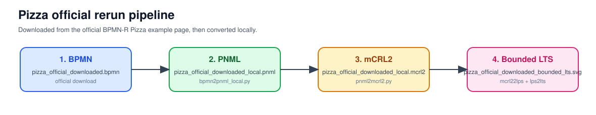
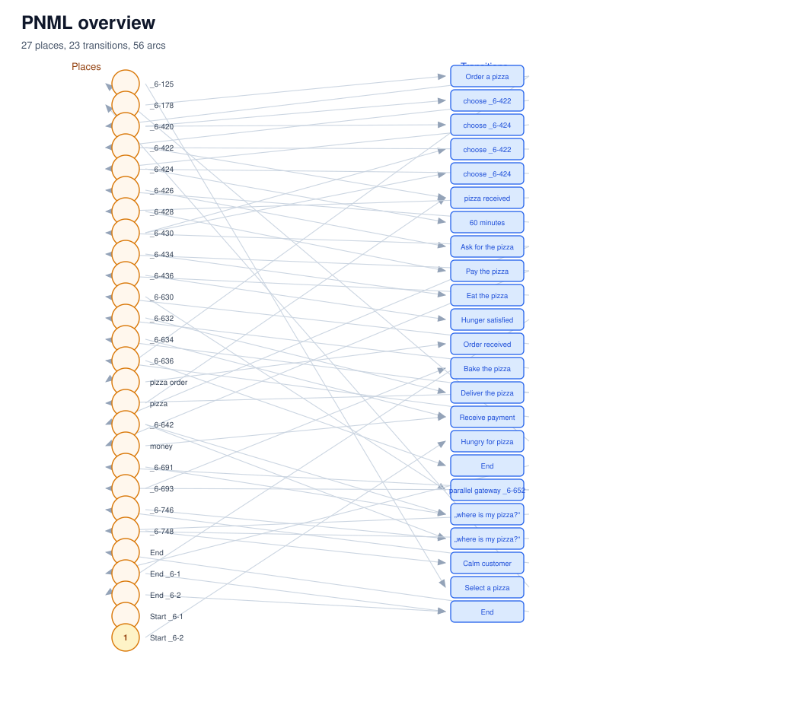
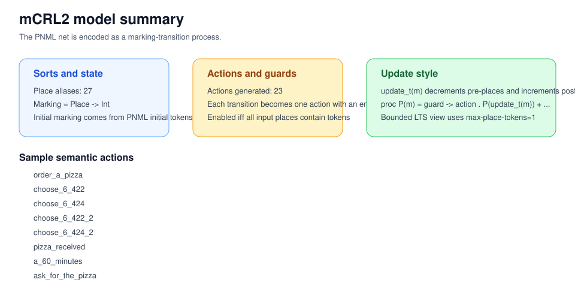
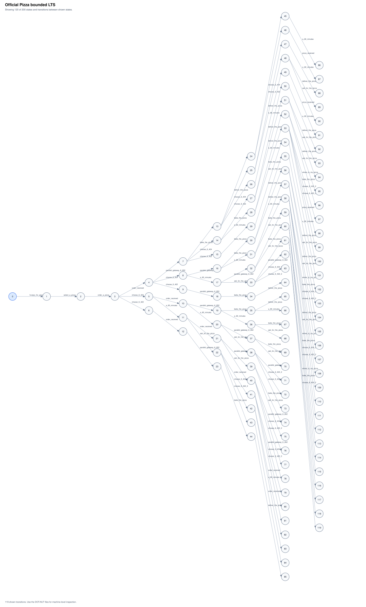
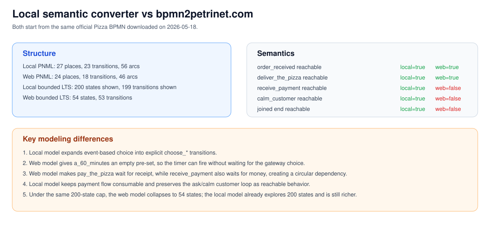
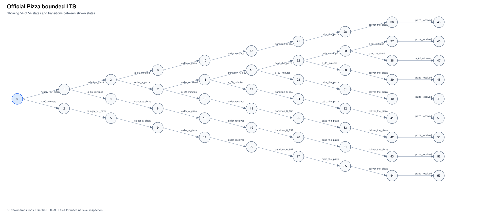

# Pizza 官方样例逐步对照报告

日期：2026-05-18

本报告比较同一份官方 Pizza BPMN 输入在两条链路上的转换结果：

1. 本地语义转换链路：`BPMN -> bpmn2pnml_local.py -> PNML -> pnml2mcrl2.py -> mCRL2`
2. 网页转换链路：`BPMN -> bpmn2petrinet.com -> PNML -> pnml2mcrl2.py -> mCRL2`

## 1. 输入是否一致

- 输入文件相同：`docs/runs/pizza_official_redownload_20260518/pizza_official_downloaded.bpmn`
- 该文件于 2026-05-18 从官方页面重新下载：
  - 页面：[https://maude.lcc.uma.es/BPMN-R/pizza/](https://maude.lcc.uma.es/BPMN-R/pizza/)
  - 原始 BPMN：[https://maude.lcc.uma.es/BPMN-R/pizza/files/triso%20-%20Order%20Process%20for%20Pizza%20V4.bpmn](https://maude.lcc.uma.es/BPMN-R/pizza/files/triso%20-%20Order%20Process%20for%20Pizza%20V4.bpmn)

输入 BPMN 统计：

| 指标 | 数值 |
| --- | ---: |
| process | 2 |
| flow node | 18 |
| task | 9 |
| message flow | 6 |
| sequence flow | 18 |
| event-based gateway | 1 |
| parallel gateway | 1 |

## 2. BPMN -> PNML 对照

| 指标 | 本地转换 | 网页转换 |
| --- | ---: | ---: |
| place | 27 | 24 |
| transition | 23 | 18 |
| arc | 56 | 46 |

观察：

1. 本地 PNML 比网页 PNML 多出 `3` 个 place、`5` 个 transition、`10` 条 arc。
2. 这些新增结构主要用于显式表示 event-based gateway 的分支选择，以及把支付/询问循环拆成更接近 BPMN 语义的可触发关系。
3. 网页 PNML 更紧凑，但把部分 message flow 和 timer 约束压缩得过头，导致关键行为丢失。

## 3. 关键部分对照

### 3.1 事件网关与计时器

| 动作 | 本地转换 pre -> post | 网页转换 pre -> post | 说明 |
| --- | --- | --- | --- |
| `a_60_minutes` | `p_4 -> p_5` | `- -> p_2` | 网页版计时器没有前置 place，会“凭空”触发 |
| `choose_*` | 有：`choose_6_422` / `choose_6_424` 等 | 无 | 本地版显式建模 event-based gateway 选择 |
| `ask_for_the_pizza` | `p_5 -> p_7, p_16` | `p_2, p_19 -> p_12` | 网页版额外依赖 `p_2, p_19` 中的循环回边 place，第一次询问就被卡住 |

### 3.2 支付链路

| 动作 | 本地转换 pre -> post | 网页转换 pre -> post | 说明 |
| --- | --- | --- | --- |
| `pay_the_pizza` | `p_6 -> p_8, p_17` | `p_3, p_13 -> p_4, p_14` | 网页版要求先拿到 `receipt` 才能支付 |
| `receive_payment` | `p_12, p_17 -> p_13` | `p_8, p_14 -> p_9, p_13` | 网页版又要求先有 `money` 才能产生 `receipt`，形成循环依赖 |

这条环路可以写成：

`Pay the pizza` 需要 `receipt`  
`Receive payment` 需要 `money`  
`Pay the pizza` 发生后才产生 `money`  
`Receive payment` 发生后才产生 `receipt`

因此网页模型中支付闭环无法启动。

### 3.3 结束同步

| 动作 | 本地转换 pre -> post | 网页转换 pre -> post |
| --- | --- | --- |
| `a_end` / `a_end_2` | `a_end: p_13 -> p_23`，`a_end_2: p_23, p_24 -> p_22` | `a_end: p_21, p_22 -> p_20` |

本地版把单个 participant 的结束和两个 participant 的 join 区分开；网页版只剩一个 `a_end`，但由于支付链路不可达，这个 joined end 也到不了。

## 4. PNML -> mCRL2 对照

| 指标 | 本地转换 | 网页转换 |
| --- | ---: | ---: |
| place alias | 27 | 24 |
| action | 23 | 18 |

从生成的 mCRL2 头部映射可以看到：

1. 本地版保留了更多语义动作，如 `choose_6_422`、`choose_6_424`、`calm_customer`、`a_end_2`。
2. 网页版动作更少，说明部分 BPMN 控制逻辑在 PNML 层已经被折叠掉了。

## 5. bounded LTS 对照

两边都使用 `max_place_tokens=1`，并对状态空间生成施加 `200` 状态上限。

| 指标 | 本地转换 | 网页转换 |
| --- | ---: | ---: |
| states | 200 | 54 |
| transitions | 199 | 53 |
| action labels | 18 (including a tau label) | 10 (including a tau label) |
| deterministic | yes | yes |

解释：

1. 本地模型在 `200` 状态上限下已经达到上限，说明其可观察行为明显更丰富。
2. 网页模型在同样上限下只生成了 `54` 个状态，说明它在前面阶段已经把很多行为压缩掉了。

## 6. 关键行为是否可达

这里使用 `lps2lts -aACTION -t1` 对 bounded LPS 做动作搜索。

| 行为 | 本地转换 | 网页转换 |
| --- | --- | --- |
| `order_received` | true | true |
| `deliver_the_pizza` | true | true |
| `receive_payment` | true | false |
| `calm_customer` | true | false |
| joined end | true (`a_end_2`) | false (`a_end`) |

结论：

1. 两条链路都能到达 `order_received` 和 `deliver_the_pizza`，说明基础“下单-制作-送达”主线都保留下来了。
2. 只有本地模型能到达 `receive_payment`。
3. 只有本地模型能到达 `calm_customer`，也就是“等待 60 分钟 -> 询问 -> 安抚”的循环在网页模型里失效。
4. 只有本地模型能到达 joined end `a_end_2`，网页模型无法完整结束两个 participant 的协作。

## 7. 可视化成果

### 本地链路

- 流程总览：
- 本地 PNML 概览：
- 本地 mCRL2 概览：
- 本地 bounded LTS：

### 对照总览

### 网页链路 bounded LTS

## 8. 最终结论

1. `bpmn2petrinet.com` 的网页转换结果可以作为结构对照，但不适合作为官方 Pizza 完整语义的唯一依据。
2. 它的核心问题是把 timer 和 message flow 约束处理得过于机械，尤其是在支付链路上引入了 `money/receipt` 的循环等待。
3. 本地 BPMN-aware 转换器虽然生成的 PNML 更大，但保留了官方 Pizza 例子真正想表达的协作语义。
4. 因此，本项目主线应以本地链路为准，即：

`官方 BPMN -> 本地语义 PNML -> mCRL2 -> 验证/可视化`
